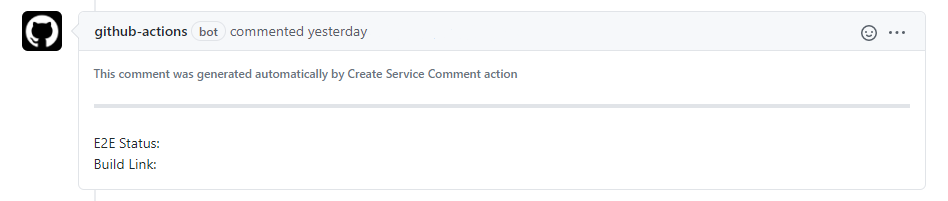

# Create Service Comment Action

The action is used to create a service comment in PR's that can be used later by Update Service Comment action.

## Inputs
### `auth-token`
**Required** String. GitHub auth token for Octokit authentication.

### `labels`
Array in JSON format. List of labels for future use by other actions.
###### example: '["E2E Status", "Build Link"]'

### `bold`
Boolean. Used to specify whether placeholders should be bold or not. Default `"False"`.

### `info-message`
String or "false". Replaces the default message. If set to "false" disables it.

## Outputs
### `comment-id`:
An ID of the created comment. Can be used later in a workflow.

## Example usage
Creating a service comment on PR's opening.
```yaml
create-service-comment:
    runs-on: ubuntu-latest
    steps:
      - uses: actions/checkout@v2
      - id: create-service-comment
        name: create-service-comment
        uses: vkhalikov/service-comment/create
        with:
            auth-token: ${{ secrets.GITHUB_TOKEN }}
            labels: '["E2E Status", "Build Link"]'
    if: ${{ github.event.action == 'opened' }}
```

This will create the following comment:

